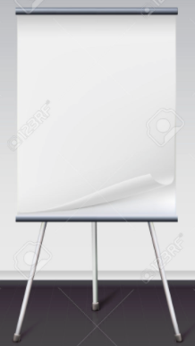

# Alfombra

Hay muchas alfombras que se venden ([ver aquí](https://www.bee-bot.us/bee-bot/beebot-mats.html)) pero no te gastes tanto dinero, te lo puedes hacer tú, nosotros hemos cogido un papel de presentaciones:

y hemos pintado un tablero de 6 x 4 cuadros, cada cuadro de 15x15 cm

Otra opción es coger un mantel de papel, o ir juntando folios con celo, pero ten en cuenta que un folio sólo te cabe 1 cuadro

