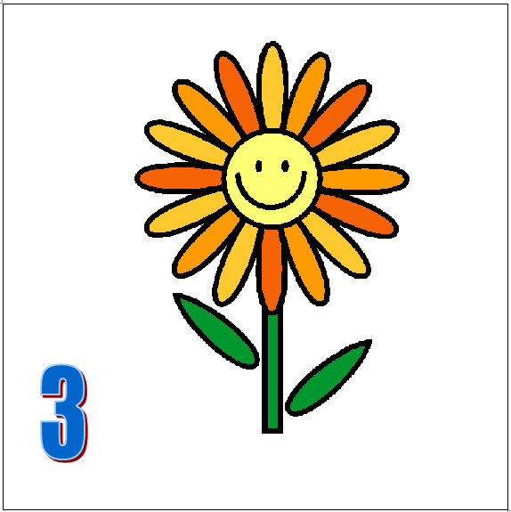

# Flores

Imprimir 3 hojas con un cuadrado de 15 x 15 cm y poner una flor con un número 1 2 y 3 en cada uno, [aquí lo tienes](http://aularagon.catedu.es/materialesaularagon2013/BeeBot/M1/Flor-BeeBot.docx) (docx - 17,54 <abbr title="KiloBytes" lang="en">KB</abbr>) por si te gusta este modelo

