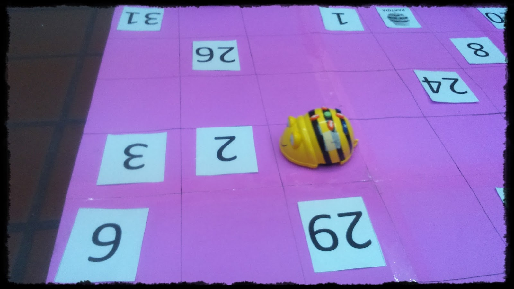

# Actividad obligatoria

## ¿Qué tengo que hacer?

Tienes que grabar en vídeo una actividad original con BeeBot, con alumnos o sin alumnos, da igual, pero tiene que ser original y subirlo al muro que te vamos a indicar

