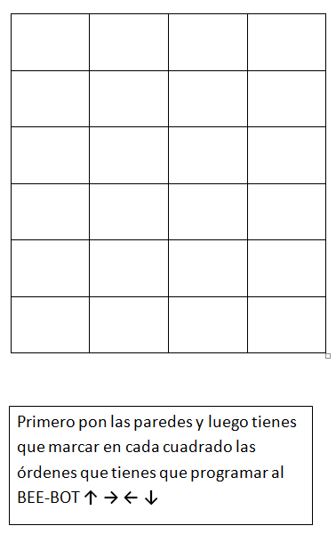

# Papeles para programar

Se imprime unas cuadrículas para que los niños escriban y piensen en las órdenes que tienen que dar al robot. si te gusta este,[ aquí tienes un documento con dos por hoja](plantilla_beebot.docx) (docx - 11,24 <abbr title="KiloBytes" lang="en">KB</abbr>) (tamaño suficiente para escribir flechas y giros):

